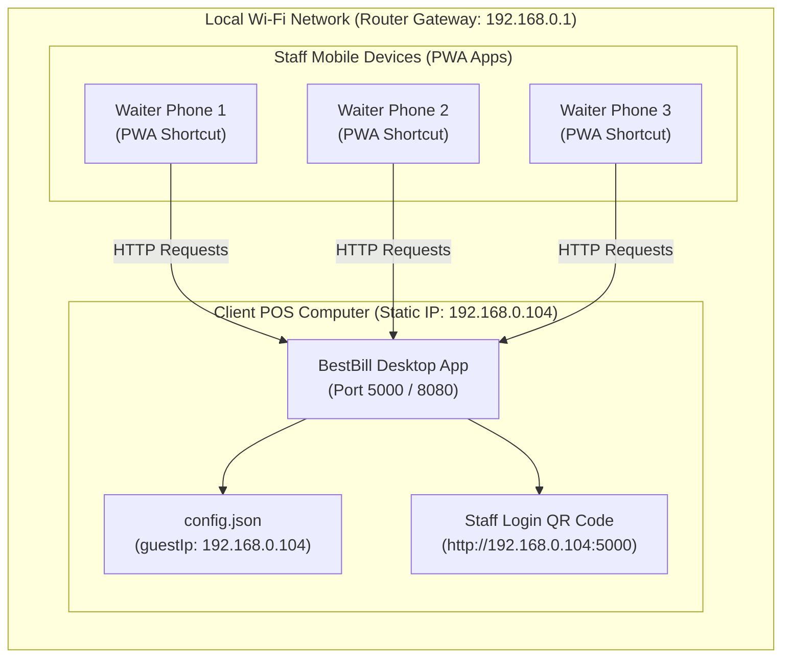
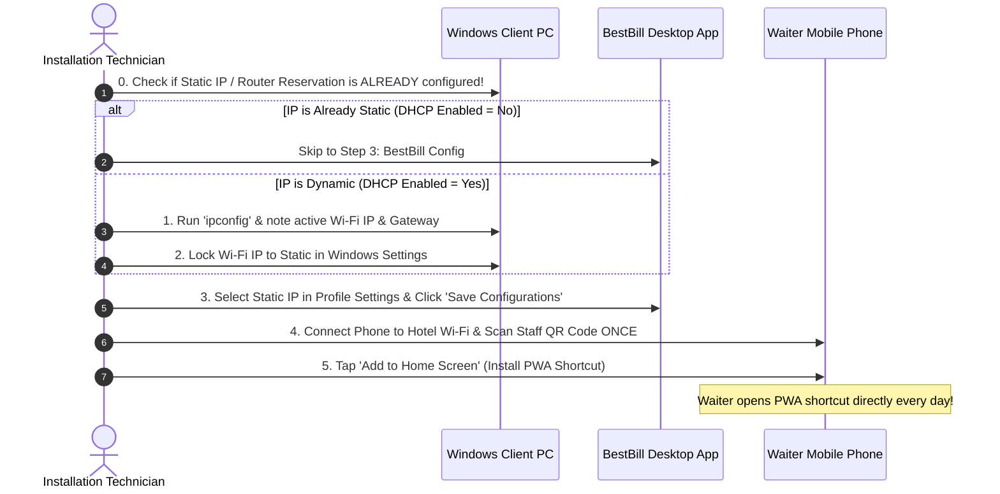

# BestBill POS — Client PC Installation & Network Setup Guide

This document is a complete, step-by-step reference guide for installing and configuring **BestBill POS** on a client's PC/Laptop, locking the static Wi-Fi IP address, and onboarding staff mobile devices for seamless daily PWA operation without rescanning QR codes.

---

## 🏗️ System Architecture Overview



---

## 🎯 The Golden Rule of IP Configuration

> 📌 **"Set Static IP once on Desktop PC = Staff NEVER scan QR code again."**
> 
> * **Desktop PC**: Fixed Static IP (e.g. `192.168.0.104`)
> * **Staff Phones**: Scan QR code ONCE on Day 1 -> Tap **"Add to Home Screen"** PWA shortcut.
> * **Daily Operation**: Staff open the PWA shortcut directly every morning. Zero QR scanning needed forever!

---

## 📋 Step-by-Step Installation Procedure



---

### PHASE 0: Check if Static IP / Reservation is ALREADY Configured (First Step!)

Before configuring network settings on a new client PC, **always check if the PC already has a Static IP or Router Reservation** (for example, if the client previously used another POS system like Petpooja, Vyapar, or Posist).

1. Open Command Prompt (`Win + R` -> type `cmd` -> press **Enter**).
2. Run command:
   ```cmd
   ipconfig /all
   ```
3. Locate your active **Wireless LAN adapter Wi-Fi** and check line **`DHCP Enabled`**:

```text
┌────────────────────────────────────────────────────────────────────────┐
│  DHCP Enabled . . . . . . . . . . . : No                               │
│  ==> STATIC IP ALREADY CONFIGURED! Skip Phase 1 & 2 -> Go to Phase 3.  │
├────────────────────────────────────────────────────────────────────────┤
│  DHCP Enabled . . . . . . . . . . . : Yes                              │
│  ==> IP is Dynamic. Proceed to Phase 1 & Phase 2 to set Static IP.     │
└────────────────────────────────────────────────────────────────────────┘
```

> 💡 **Saved Time**: If `DHCP Enabled` is **`No`**, the previous POS installer already configured Static IP! Note down the IPv4 address and skip directly to **PHASE 3**.

---

### PHASE 1: Identify the Correct Wi-Fi Adapter

1. Run command in Command Prompt:
   ```cmd
   ipconfig
   ```
2. Locate your **Wireless LAN adapter Wi-Fi**.

#### ⚠️ How to Spot the Real Wi-Fi vs. Virtual Adapters

When multiple adapters are listed, look at the **Default Gateway** line:

| Adapter Name | Default Gateway | Status | Action |
| :--- | :--- | :--- | :--- |
| **Wireless LAN adapter Wi-Fi 2** | *(Blank / Empty)* | Virtual / Hotspot Adapter | ❌ **IGNORE** |
| **Wireless LAN adapter Wi-Fi** | `192.168.0.1` | **Real Wi-Fi Router Connection** | ✅ **USE THIS** |

> 🔑 **Rule of Thumb**: Always pick the adapter that has a **Default Gateway IP address** (e.g., `192.168.0.1` or `192.168.1.1`).

---

### PHASE 2: Lock Windows Wi-Fi to Static IP

*(Only required if `DHCP Enabled` was `Yes` in Phase 0)*

#### Method A: Windows 11 Settings GUI (Recommended)

1. Open **Windows Settings** (`Win + I`) -> Go to **Network & internet** -> **Wi-Fi**.
2. Click **Wi-Fi properties** (your connected network).
3. Scroll down to **IP assignment** and click **Edit**.
4. Change from **Automatic (DHCP)** to **Manual**.
5. Toggle **IPv4** to **ON**.
6. Enter the network parameters:

```text
┌────────────────────────────────────────────────────────┐
│  IP address:            192.168.0.104  (or client IP)  │
│  Subnet prefix length:  24                             │
│  Gateway:               192.168.0.1   (router IP)      │
│  Preferred DNS:         8.8.8.8                        │
│  DNS over HTTPS:        Off                            │
│  Alternate DNS:         8.8.4.4                        │
└────────────────────────────────────────────────────────┘
```

7. Click **Save**.

#### Method B: Classic Control Panel (`ncpa.cpl`)

1. Press `Win + R`, type `ncpa.cpl`, and press **Enter**.
2. Right-click **Wi-Fi** -> Select **Properties**.
3. Double-click **Internet Protocol Version 4 (TCP/IPv4)**.
4. Select **Use the following IP address**:
   * **IP address**: `192.168.0.104`
   * **Subnet mask**: `255.255.255.0`
   * **Default gateway**: `192.168.0.1`
5. Select **Use the following DNS server addresses**:
   * **Preferred DNS server**: `8.8.8.8`
   * **Alternate DNS server**: `8.8.4.4`
6. Click **OK**, then click **OK** again.

---

### PHASE 3: BestBill Desktop App Configuration

1. Open **BestBill Desktop App** on the client PC.
2. Go to **Profile Settings** -> **Local Network & Staff Connection**.
3. Under **GUEST PORTAL LOCAL IP**, select your static IP (e.g., `192.168.0.104`).
4. Click **Save Configurations**.
5. Confirm that the Target URL displays:
   `http://192.168.0.104:5000/#/guest/order/1`
6. Verify that the **Staff Login QR** displays `http://192.168.0.104:5000`.

---

### PHASE 4: Onboard Waiter Phones (Done ONCE Per Device)

1. Connect the waiter's phone to the **Hotel/Restaurant Wi-Fi**.
2. Open the phone camera and scan the **Staff Login QR Code** from the BestBill Profile screen.
3. Once the login page loads in the phone browser:

#### 📱 For Android (Google Chrome):
1. Tap the **3 vertical dots menu** in the top-right corner.
2. Select **"Add to Home Screen"** or **"Install app"**.
3. Confirm by tapping **Add**.

#### 🍎 For iPhone / iPad (Apple Safari):
1. Tap the **Share icon** (square with up arrow) at the bottom toolbar.
2. Scroll down and tap **"Add to Home Screen"**.
3. Tap **Add** in the top-right corner.

---

### PHASE 5: Verification & Audit Checklist

Before leaving the client location, run this quick 3-step audit:

```bash
# Command to verify Static IP status in Windows Terminal
ipconfig /all
```

- [ ] **Check 1: Static IP Status**
  Under `Wireless LAN adapter Wi-Fi`, confirm:
  `DHCP Enabled . . . . . . . . . . . : No`
- [ ] **Check 2: PWA Icon Created**
  Confirm the **BestBill Staff** icon appears on waiter phone home screens.
- [ ] **Check 3: Restart Test**
  Reboot the client PC. Open the waiter PWA shortcut on phone — verify it opens directly and logs in without asking for QR scan.

---

## ❓ Troubleshooting & FAQs

### Q1: What if the waiter gets "Unable to connect to server"?
* **Cause A**: Waiter phone is connected to mobile data (4G/5G) instead of Hotel Wi-Fi.
  * *Fix*: Connect waiter phone to Hotel Wi-Fi.
* **Cause B**: Client computer Firewall is blocking port 5000.
  * *Fix*: Run Command Prompt as Admin and execute:
    ```cmd
    netsh advfirewall firewall add rule name="BestBill POS Port 5000" dir=in action=allow protocol=TCP localport=5000
    ```

### Q2: What if the client replaces their Wi-Fi Router?
* **Action Required**: The new router may use a different subnet (e.g., `192.168.1.x` instead of `192.168.0.x`).
* Repeat **Phase 0** to **Phase 4** with the new router's gateway IP.

### Q3: What if Android Chrome says "This app cannot be installed"?
Google Chrome on Android strictly blocks PWA installations if the URL starts with `http://` instead of `https://` (unless it's localhost). Since you are using a local IP like `192.168.0.104`, Chrome blocks it for security reasons.

Here is the exact step-by-step fix for the Android Tablet/Phone:

1. Open Google Chrome on the Android tablet.
2. In the URL bar, type exactly this: `chrome://flags/#unsafely-treat-insecure-origin-as-secure` and hit Enter.
3. You will see a setting highlighted in yellow. In the text box under it, type your server's IP and port (e.g., `http://192.168.0.104:5000`).
4. Change the dropdown next to it from "Disabled" to **Enabled**.
5. A blue **Relaunch** button will appear at the bottom. Click it to restart Chrome.
6. Now, open your BestBill URL again. The "Install App" button will work perfectly!

*Note: You only have to do this once on each waiter's Android device.*

---

*Guide generated for BestBill POS deployments. Last updated: September 2026.*
