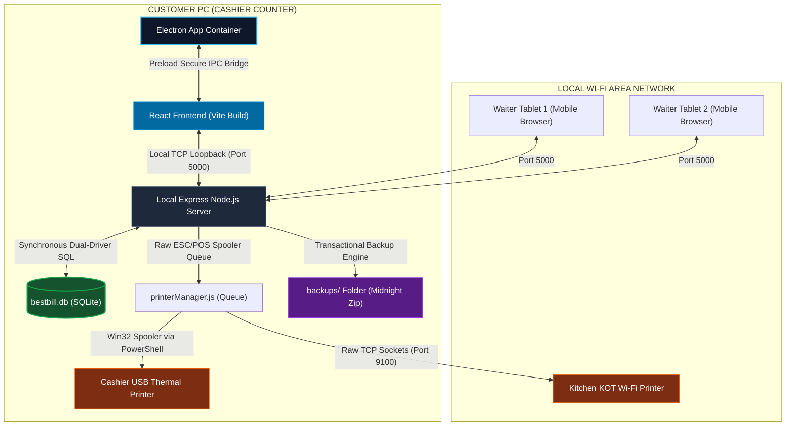
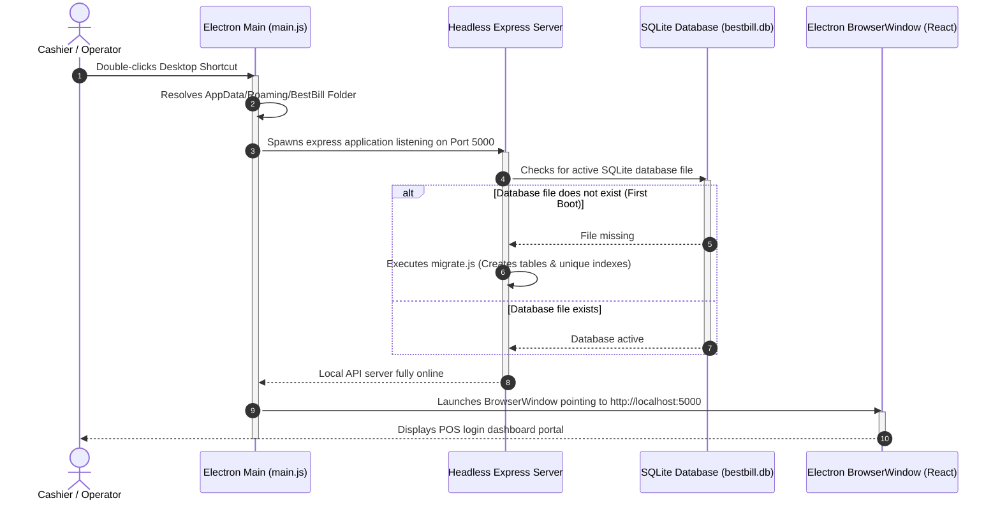
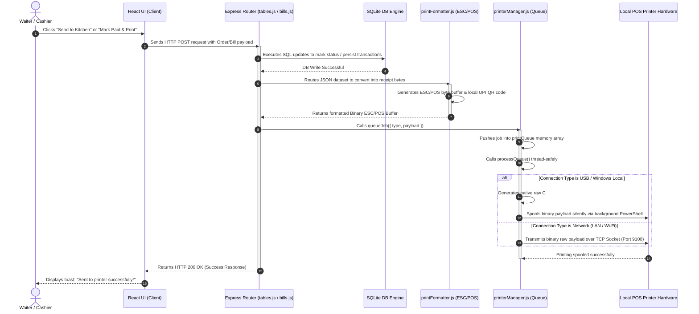

# 1. BestBill POS - Offline Application Flow & Architecture Guide

This manual describes the offline-first application flow, component execution lifecycle, local network topology, and spooled hardware printer architecture of the **BestBill Desktop POS** on a customer's computer.

---

## 1. System Architecture Overview

BestBill POS operates as a self-contained, 100% self-hosted local application. It requires zero active internet connections or third-party cloud APIs to perform standard hotel management, table booking, dine-in billing, and kitchen order ticket (KOT) operations.

---

## 2. Component Bootstrapping Sequence

When the cashier double-clicks the BestBill POS shortcut on the desktop, the application executes the following sequential steps to initialize the environment:

---

## 3. Order Placement & Print Spooler Sequence

When waiters submit a Dine-In table order or cashiers print guest receipts, the backend processes operations thread-safely via our custom offline spool queue manager:

---

## 4. Key Offline Architectural Fail-Safes

To ensure 100% operation uptime on customer cash counters, the offline POS includes these resilient features:

### A. Dual-Driver Database Strategy
To prevent native package compiler bottlenecks (like missing Visual C++ dependencies on the customer's PC), our database adapter dynamically selects the best driver at runtime:
1.  **Built-in `node:sqlite` (Primary)**: Uses Node.js's official built-in synchronous SQLite library. It requires zero compilation, zero downloads, and runs natively on Node >= 22.5.0.
2.  **Fallback `better-sqlite3` (Secondary)**: Used if the computer runs an older Node version. If native compilation fails during setup, NPM completely ignores the issue, preventing setup crashes.

### B. Auto-healing Spooler Retries
The `printerManager.js` features a thread-safe execution loop:
*   If a thermal printer goes offline (e.g. out of paper or power cut), it logs the fail and attempts to **retry printing 3 times with 2-second intervals**.
*   After maximum retries, the job is cleanly dropped to avoid blocking subsequent waiter orders.

### C. Isolated Offline Backups
The database uses a transactional backup script:
*   A nightly scheduler creates a robust SQLite `.backup()` and zips it up with config files.
*   Zipping transactions prevents backup corruption even if the computer suffers a sudden power failure mid-operation.
