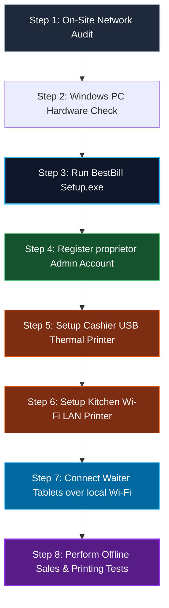
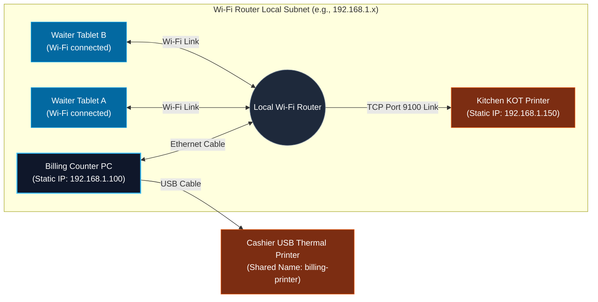

# 3. BestBill POS - Hotel Onboarding & Setup Guide

This guide provides a professional, step-by-step workflow for the **Product Owner / Installer** to set up, configure, and troubleshoot the BestBill Offline POS application directly on a customer's cashier computer.

---

## 1. Setup & Onboarding Master Checklist

When deploying at a new hotel restaurant site, follow this progressive, step-by-step installation flow:



---

## 2. On-Site Onboarding Steps

### Step 1: Pre-installation Audit
*   **Computer Requirements**: Ensure the customer PC runs Windows 10/11 (64-bit) with at least 4GB RAM (8GB recommended).
*   **Local Router Integration**: 
    *   Set up a strong local Wi-Fi router directly at the cashier desk (an active internet connection is **not** required).
    *   Connect the Cashier PC to this router using an Ethernet LAN cable for maximum speed and zero tablet latency.
    *   Connect the cashier's USB thermal printer and kitchen's static IP Wi-Fi printer to the same router network.

### Step 2: Install BestBill POS
1.  Copy the compiled installer (`BestBill Setup.exe`) from your USB drive onto the customer PC.
2.  Double-click the installer and follow the prompt. 
3.  The wizard will configure all desktop shortcuts and launch the application.

### Step 3: Initial Hotel & Admin Registration
1.  On the first launch of the application, fill out the proprietor's registration form:
    *   **Hotel Legal Name**: Displays at the top of guest receipts.
    *   **Proprietor Name & Mobile**: Business contacts.
    *   **Login Email / Passcode**: Set a strong, easily remembered passcode.
2.  Click **Register**. The SQLite database automatically creates schemas and logs the owner directly into the offline dashboard.

### Step 4: Setup Cashier USB thermal receipt printer
1.  Plug the cashier printer's USB cable into the PC. Ensure Windows printer drivers are installed.
2.  Navigate to **Windows Control Panel > Devices and Printers**.
3.  Right-click your receipt printer icon and select **Printer Properties**.
4.  Navigate to the **Sharing** tab, check **Share this printer**, and enter a simple name (e.g. `billing-printer`).
5.  Open the BestBill dashboard, navigate to **Hotel Profile > Offline Physical Printers**, and set the parameters:
    *   **Cashier Billing Printer - Connection Type**: `USB / Windows Spooled`
    *   **Windows Shared / Port Name**: Enter `billing-printer` exactly.
6.  Click **Save Printer Setup**.

### Step 5: Setup Kitchen LAN Wi-Fi KOT printer
1.  Assign a static IP address to the kitchen printer on the router settings page (e.g., `192.168.1.150`).
2.  Open the BestBill dashboard, navigate to **Hotel Profile > Offline Physical Printers > Kitchen KOT Printer** and set:
    *   **Connection Type**: `Network (LAN/Wi-Fi)`
    *   **IP Address**: `192.168.1.150`
    *   **Port**: `9100` (Standard raw socket port).
3.  Click **Save Printer Setup**.

### Step 6: Connect Waiter Tablets over local Wi-Fi
1.  Note the local LAN IP address of the counter PC shown on the owner dashboard (e.g., `192.168.1.100`).
2.  Connect all waiter tablets/mobile devices to the hotel's local Wi-Fi network.
3.  Open Chrome or Safari on the tablets and navigate to:
    ```
    http://192.168.1.100:5000
    ```
4.  Onboard waitstaff via the "Staff Command" section of the owner dashboard. Waiters can now log in, take orders, and submit KOT slips which print silently at the kitchen counter.
5.  *Tip: Tap the browser settings button on the tablets and select **"Add to Home Screen"** to save a permanent POS app shortcut icon!*

---

## 3. Local Hardware Wi-Fi LAN Topology



---

## 4. End-of-Shift Backup Verification
1.  Explain to the cashier that automatic backups occur daily at midnight.
2.  To perform a manual backup at shift change:
    *   Open the Hotel Profile settings dashboard.
    *   Click the **Create Backup** button.
    *   A timestamped zip file compiles instantly and saves to the local backup directory:
        `C:\Users\<Windows-User>\AppData\Roaming\BestBill\backups\`
