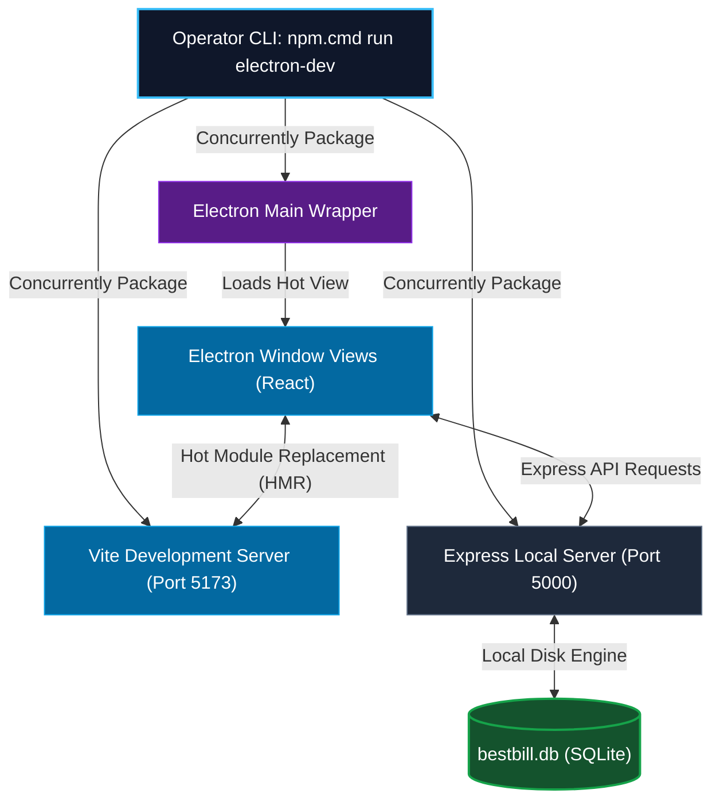
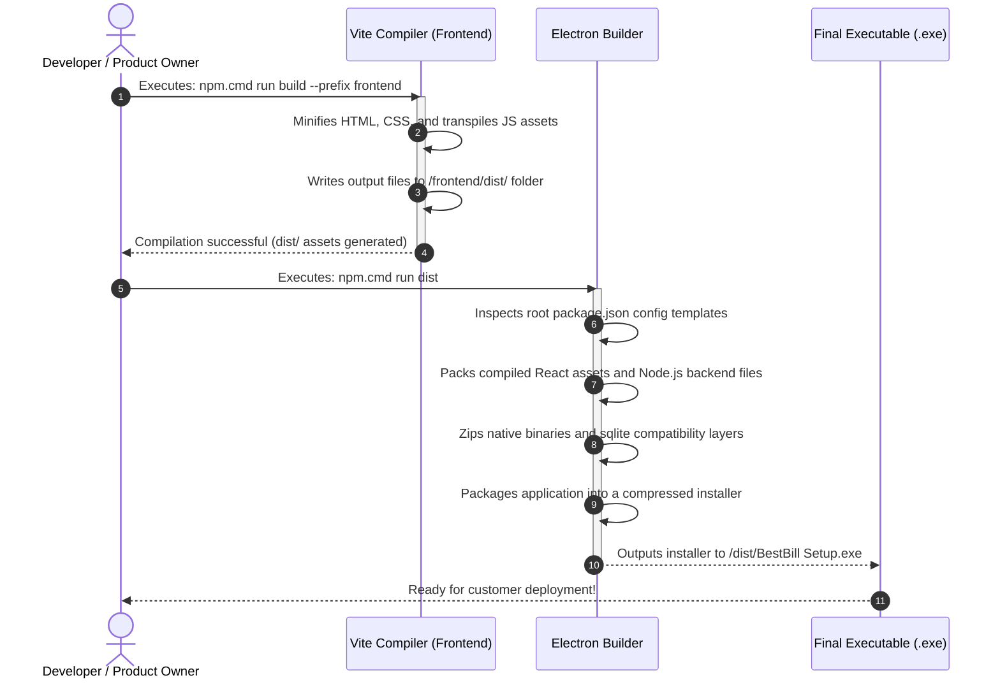

# 2. BestBill POS - Local Development & Customization Guide

This manual details how to test the application locally, modify frontend UI or backend database query routes, hot-reload electron container processes, and compile a single-file, production-ready Windows Desktop Installer (`.exe`).

---

## 1. Development Process & Concurrency Topology

During development, running `npm.cmd run electron-dev` starts three concurrent processes that cooperate over local ports to provide hot-reloading development support:



---

## 2. Dev Environment Pre-requisites & Setup

To edit or test the offline POS system locally, ensure your machine has the following tools installed:

| Dependency | Purpose | Recommended Version |
| :--- | :--- | :--- |
| **Node.js** | Backend server runtime and compiler | `v22.5.0` or higher (Ensures built-in zero-compile `node:sqlite` works out-of-the-box) |
| **NPM** | package script executor | `v10.x` or higher |

### Setup Dependencies

Open PowerShell in the root directory `d:\BestBill-Offline` and run these commands to install dependencies:

```powershell
# 1. Install root workspace runner dependencies
npm install

# 2. Install backend SQLite, Express, and print spool dependencies
npm install --prefix backend

# 3. Install React, Axios, and Lucide Icon packages
npm install --prefix frontend
```

---

## 3. Running & Editing the POS Locally

### Launching Dev Mode
Run the concurrent dev command in your terminal:
```powershell
npm.cmd run electron-dev
```
*   **Vite Dev Server** launches in the background, serving the React UI on port 5173.
*   **Express Server** boots up on port 5000, listening on `0.0.0.0` for backend API routing.
*   **Electron App** launches in a desktop container, pointing its browser view directly to Vite's dev port with Chrome DevTools accessible (`Ctrl + Shift + I`).

### How to Modify Code
*   **Modifying UI (React)**: Edit files in `frontend/src/`. Vite's **Hot Module Replacement (HMR)** updates changes instantly inside the Electron browser view without reloading the app or losing current state.
*   **Modifying Queries/Print APIs**: Edit files in `backend/src/routes/` or `backend/src/services/`. Since these run inside the local Express process, you will need to restart `npm.cmd run electron-dev` in your terminal to reload backend logic updates.

---

## 4. Compile & Distribution Packaging Flow

When your custom POS changes are ready, follow this build workflow to package the offline POS into a single Windows installer:



### Packaging Commands
Execute these commands in your PowerShell terminal to generate the executable:
```powershell
# 1. Compile frontend assets
npm.cmd run build --prefix frontend

# 2. Package the Electron app
npm.cmd run dist
```
Once complete, copy the installer from `d:\BestBill-Offline\dist\BestBill Setup.exe` onto a USB thumb drive to carry out the customer PC installation.
