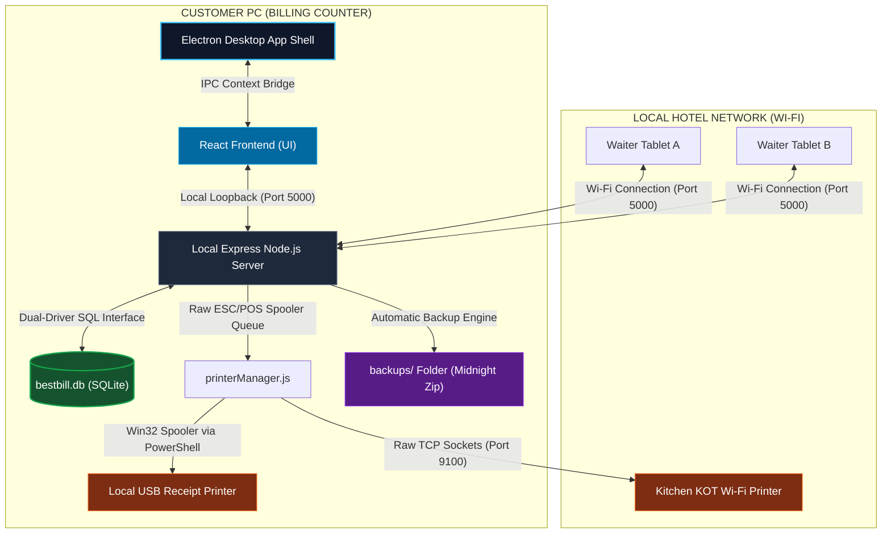

# BestBill POS - Offline Desktop POS Product Setup & Operations Manual

This document provides a comprehensive operational guide for the **BestBill Offline Desktop POS** application. As the Product Owner, use this manual to understand the application's offline architecture, run local customization sprints, and onboard new hotels on customer-billing PCs.

---

## 1. Application Flow & Customer PC Operations

BestBill POS is packaged as a high-performance **native desktop application** using Electron, carrying a local Express server and a resilient SQLite database in a zero-external-dependency wrapper.

### The Offline Architecture Flow



### Core Flow of Operations on Customer PC

1.  **Application Launch**: The customer double-clicks the desktop shortcut. Electron boots up and spawns a headless background Node.js process.
2.  **Server Initialization**: The local Node.js process hosts the Express APIs on port `5000` (binding to `0.0.0.0` so other local network nodes can see it) and auto-spins the SQLite DB engine.
3.  **Database Connection**:
    *   The app checks the user's `AppData/Roaming/BestBill/` system folder.
    *   If no database exists (first launch), it runs [migrate.js](file:///d:/BestBill-Offline/backend/src/db/migrate.js) to build all POS schemas and sync seed data.
    *   If node >= 22.5.0 is present, it uses the official, lightning-fast built-in `node:sqlite` driver; otherwise, it falls back to compiled `better-sqlite3`.
4.  **Local Dashboard Boot**: The Electron window opens, immediately loading the compiled React UI. The customer is greeted with the login portal (running at `http://localhost:5000`).
5.  **Offline Billing & Orders**:
    *   Cashier adds table items, applies discounts, computes GST, and clicks **"Generate Bill & Mark Paid"**.
    *   The system formats a raw binary ESC/POS buffer locally and routes it to `printerManager.js`.
    *   The manager spools the print job directly to the cashier's shared USB receipt printer using Windows Spooler APIs via native PowerShell background commands.
6.  **Tablet Waiter Operations**:
    *   The counter PC displays its local LAN IP address (e.g., `192.168.1.100`) on the dashboard.
    *   Waiters connect their mobile devices to the hotel's Wi-Fi router and navigate to `http://192.168.1.100:5000`.
    *   Orders are instantly pushed to the counter PC's SQLite database, and Kitchen KOT slips are spooled silently to the kitchen static IP printer over raw TCP sockets on port `9100`.
7.  **Auto Backups**: Every night at midnight, the background process runs a transactional snapshot of the database and zips it up with printer configurations, saving it to `AppData/Roaming/BestBill/backups/`.

---

## 2. Local Development & Customization Guide

If you want to customize the codebase, add new features, or run local tests:

### Prerequisite Environment Setup

Make sure the development machine has the following tools installed:
*   **Node.js**: Version `>= 22.5.0` (highly recommended so the app utilizes node's native `node:sqlite` driver and bypasses C++ build chain errors completely).
*   **Git**: For version control if required (though the customer folder runs completely independent of the online repo).

### Running in Development Mode

The root directory contains a pre-configured `package.json` script to launch the full development suite concurrently with a single command.

1.  Open PowerShell in the root directory `d:\BestBill-Offline`.
2.  Install dependencies in all subfolders:
    ```powershell
    # Install dependencies across root, frontend, and backend folders
    npm install
    npm install --prefix backend
    npm install --prefix frontend
    ```
3.  Launch the hot-reloading desktop development stack:
    ```powershell
    npm.cmd run electron-dev
    ```
    *   This fires **Vite Dev Server** for React (port 5173).
    *   This boots the **Express Node.js Server** (port 5000).
    *   This opens the **Electron Container Window**, pointing its renderer directly at Vite's server.

### Code Editing & Hot Reloading
*   **Frontend Changes**: Any edits inside `frontend/src/` will hot-reload instantly inside the open Electron browser view, just like a standard Vite web project.
*   **Backend Changes**: Edits inside `backend/src/` will require restarting the stack (or running node index with `nodemon` inside `/backend` in a separate terminal panel).

### Packaging a Windows Desktop Installer (`.exe`)

When you are ready to distribute a new release to a customer's computer:

1.  Compile a production build of the React assets:
    ```powershell
    npm.cmd run build --prefix frontend
    ```
2.  Package the native Electron app using `electron-builder`:
    ```powershell
    npm.cmd run dist
    ```
3.  The package engine compiles code, packs assets, configures native drivers, and outputs a single-file, production-ready installer:
    *   **Installer Path**: `dist/BestBill Setup.exe`

---

## 3. Product Owner's Customer PC Setup Guide

Follow this step-by-step onboarding protocol as the Product Owner when setting up the offline software on a new hotel customer's billing computer.

### Step 1: Pre-installation Site Assessment
Before arriving at the restaurant:
1.  **Check Counter PC Specs**: Ensure the billing computer runs Windows 10 or 11 (64-bit) with at least 4GB RAM (8GB recommended).
2.  **Configure local Wi-Fi Router**: 
    *   Set up a dedicated, strong local Wi-Fi router at the cash counter (no internet required).
    *   Reserve static IPs on the router for any network/Wi-Fi thermal printers (e.g., kitchen printer).
    *   Connect the Counter PC to this Wi-Fi router via Ethernet cable for maximum signal stability.

### Step 2: Install BestBill POS
1.  Copy the compiled `BestBill Setup.exe` file onto a USB thumb drive and paste it onto the customer's desktop.
2.  Double-click the installer. The wizard will automatically install requirements, set up desktop/start menu shortcuts, and boot the application.
3.  *Note: The app will boot immediately and create its data folders inside the customer's Windows AppData directory:*
    *   📂 `C:\Users\<Windows-User>\AppData\Roaming\BestBill\bestbill.db`

### Step 3: Register the Hotel & Super Admin
1.  On first boot, you will be presented with the **Business Onboarding Registration** screen.
2.  Fill in the details:
    *   **Owner Name**: Hotel proprietor's name.
    *   **Hotel Name**: Restaurant/Hotel name (printed on receipt headers).
    *   **Mobile / Address**: Official business contacts.
    *   **Login Email / Password**: Set a strong passcode (this becomes the Owner master credentials).
3.  Click **Register**. The SQLite database automatically populates the schema, registers the hotel entity, links the owner account, and securely logs you into the dashboard.

### Step 4: Setup Waiter Tablets over Local Wi-Fi
1.  On the dashboard, check the top header to retrieve the Counter PC's local network IP address (e.g., `192.168.1.100`).
2.  Take the waiter's tablet or mobile phone, connect it to the hotel's counter Wi-Fi network, and open Chrome/Safari.
3.  Navigate to:
    ```
    http://192.168.1.100:5000
    ```
4.  The waiter login portal appears instantly. Log in using the waiter credentials (onboarded in the "Staff Command" section of the owner dashboard).
5.  **Product Tip**: Tap the browser's settings button and select **"Add to Home Screen"** to save a permanent, beautiful fullscreen POS app icon on the tablet!

### Step 5: Connect Hardware Receipt Printers

Navigate to **Hotel Profile > Offline Physical Printers** on the counter PC to configure hardware:

```
┌────────────────────────────────────────────────────────────┐
│                  OFFLINE PHYSICAL PRINTERS                 │
├────────────────────────────────────────────────────────────┤
│  Cashier Billing Printer (Green dot)                       │
│  [ Connection Type: USB / Windows Spooled ]                │
│  [ Windows Share Name: billing-printer    ]                │
├────────────────────────────────────────────────────────────┤
│  Kitchen KOT Printer (Amber dot)                           │
│  [ Connection Type: Network (LAN/Wi-Fi)   ]                │
│  [ Printer IP Address: 192.168.1.150      ]                │
│  [ Communication Port: 9100               ]                │
└────────────────────────────────────────────────────────────┘
```

#### A. Setting up a Network LAN/Wi-Fi Printer (e.g., Kitchen KOT)
1.  Connect the printer to the Wi-Fi router.
2.  In the printer config card, set the Connection Type to `Network (LAN/Wi-Fi)`.
3.  Enter the static IP assigned to the printer (e.g., `192.168.1.150`).
4.  Click **Save Printer Setup**. 

#### B. Setting up a Direct USB Printer (e.g., Billing Counter Printer)
1.  Plug the USB receipt printer into the billing PC.
2.  In Windows, navigate to **Control Panel > Devices and Printers**.
3.  Right-click the receipt printer icon and select **Printer Properties**.
4.  Navigate to the **Sharing** tab, check **Share this printer**, and give it a simple share name (e.g., `billing-printer`).
5.  In the BestBill printers config card, select `USB / Windows Spooled` and enter `billing-printer` exactly into the field.
6.  Click **Save Printer Setup**. 

### Step 6: Define Receipt Layout Paper Sizes
1.  In the main Hotel Profile card, select the correct receipt roll size under **Paper Roll Size**:
    *   `Standard Receipt (80mm)` for wide thermal receipts.
    *   `Compact Receipt (58mm)` for compact receipt rolls.
2.  Click **Save Profile Settings**. Receipt columns will mathematically align layouts according to the selected dimension.

### Step 7: Verify Backup Configuration
1.  Explain to the customer that local backups are completely automated and run silently every night.
2.  Show the customer the backup restoration options under profile settings. Tell them they can click **"Create Backup"** at the end of every business shift to instantly save a transactional zip snapshot of their sales ledger onto their disk.
